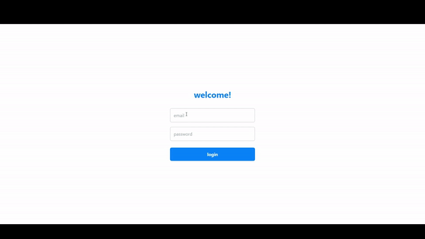
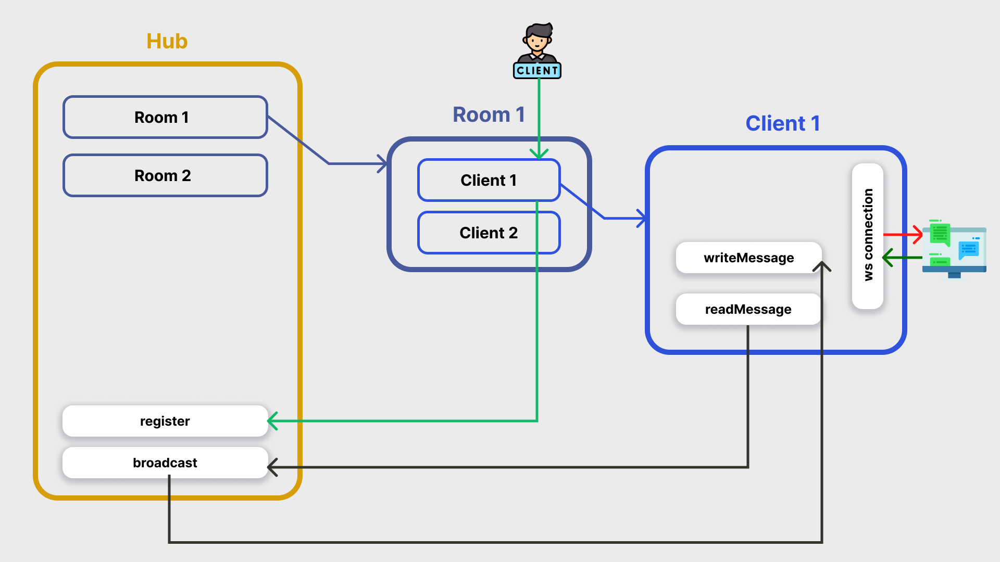

# REALTIME CHAT (NextJs | Typescript | Tailwind CSS | GoLang | Websockets)

This is a small example of a web chat app with websockets.

## Note

This projects was build with the goal of learning this server architecture. However, in the future it will be refactored to a hexagonal architecture.

## Demo

## Hub architecture

